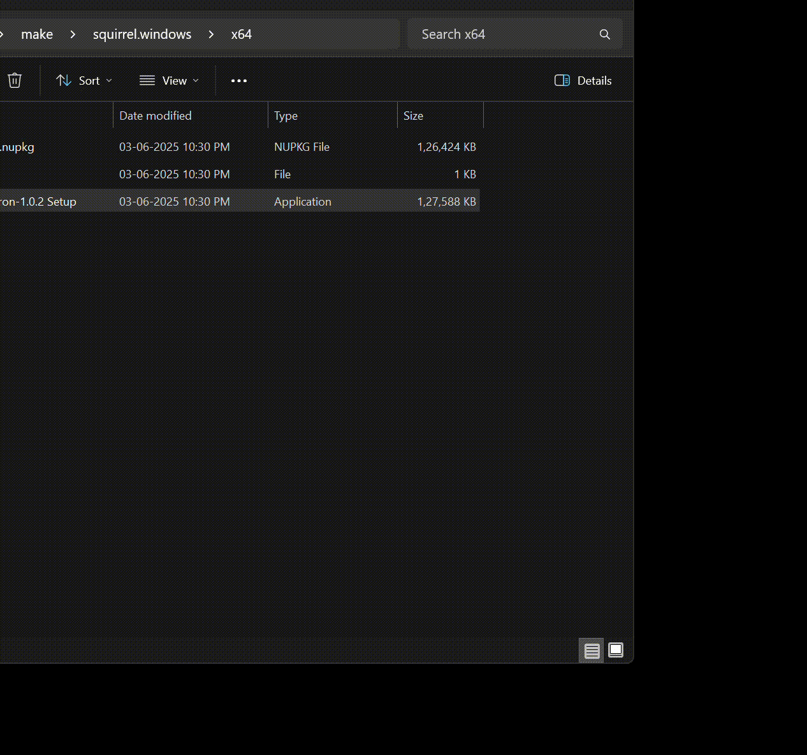

# WhatsApp Bulk Message Sender (Electron & Puppeteer)


This desktop application allows you to automate sending bulk WhatsApp messages from an Excel spreadsheet. It uses Electron to create a cross-platform desktop experience and Puppeteer to interact with WhatsApp Web.



## Table of Contents

1.  [How to Use the Application](#how-to-use-the-application)
2.  [Key Features](#key-features)
3.  [Setup and Installation (for Running from Source)](#setup-and-installation-for-running-from-source)
4.  [Building the Application (for Developers)](#building-the-application-for-developers)
5.  [Project Structure](#project-structure)
6.  [Important Considerations & Disclaimer](#important-considerations--disclaimer)
7.  [Troubleshooting](#troubleshooting)
8.  [Contributing](#contributing)

## How to Use the Application

Once you have the application running (either from source or a built executable):

1.  **Launch the Application:** Open the application.
2.  **Select Excel File:**
    *   Click the "Select Excel File" button.
    *   Choose your Excel file (`.xlsx` or `.xls`). This file **must** contain columns for contact names and their phone numbers.
3.  **Specify Column Names:**
    *   Once the Excel file is selected, the "Phone Number Column" and "Name Column" dropdowns will be populated with the headers from your Excel sheet.
    *   Select the correct column from your Excel sheet that contains the **phone numbers**.
    *   Select the correct column from your Excel sheet that contains the **names** of the recipients.
4.  **Configure Screenshot Directory (Optional):**
    *   By default, any screenshots taken upon failure will be saved in a `failure_screenshots` folder in the directory where the application is run from (or where the executable is located).
    *   To change this, click "Change Directory" and select your preferred folder.
    *   Click "Use Default" to revert to the default location.
5.  **Customize Message Template:**
    *   Edit the "Message Template" box.
    *   Use `{{Name}}` as a placeholder where you want the recipient's name (from the "Name Column" you selected) to be inserted.
    *   To create paragraphs or line breaks in your message, simply press Enter in the textarea (this will insert a `\n` newline character).
    ```
    Example:
    Hello {{Name}},

    This is the first paragraph of our message.
    We hope you are doing well!

    Best regards,
    Your Team
    ```
6.  **Set Default Country Code (Optional but Recommended):**
    *   If your phone numbers in the Excel sheet do not already include the international country code (e.g., they are local numbers like `9876543210`), enter the default country code in the "Default Country Code" field (e.g., `91` for India, `1` for the US).
    *   If your numbers are already in full international format (e.g., `919876543210`), you can leave this blank or ensure it doesn't incorrectly prefix. The script attempts to apply it if a number looks like a local number (e.g., 10 digits for India).
7.  **Start Sending:**
    *   Click the "Start Sending Messages" button.
8.  **WhatsApp Web Login (First Time / Session Expired):**
    *   A new browser window (controlled by the application) will open and navigate to WhatsApp Web.
    *   If prompted with a QR code, open WhatsApp on your phone, go to `Settings` > `Linked Devices` > `Link a Device`, and scan the QR code.
    *   The application will save your session, so you typically won't need to scan the QR code every time.
9.  **Monitor Progress:**
    *   The application UI will display a progress bar.
    *   Live statistics will show: Total Contacts, Processed, Successful, Failed, Invalid Numbers, and Remaining.
    *   An Estimated Time Remaining (ETA) will be displayed.
    *   The "Log Output" area will show detailed actions and any errors encountered.
10. **Completion:**
    *   Once all messages are processed, the progress bar will show 100%, and the ETA will indicate "Completed!".
    *   A summary of successful, failed, and invalid messages will be available.
    *   The control buttons will be re-enabled for another run.

## Key Features

*   **Bulk Messaging:** Send personalized WhatsApp messages to multiple contacts from an Excel sheet.
*   **Excel Integration:** Reads contact names and phone numbers directly from `.xlsx` or `.xls` files.
*   **Dynamic Column Mapping:** Automatically detects Excel headers and allows user to select Name and Phone Number columns.
*   **Message Personalization:** Use `{{Name}}` placeholder in your message template.
*   **Multi-Paragraph Support:** Handles messages with line breaks correctly.
*   **Session Persistence:** Remembers your WhatsApp Web session to minimize QR code scanning (via `userDataDir`).
*   **Configurable Delays:** Built-in delays to make interactions appear more human-like and reduce the risk of being flagged (though use with caution).
*   **Country Code Handling:** Option to add a default country code to numbers.
*   **Live Progress Tracking:** UI shows a progress bar, ETA, and live counts of processed, successful, failed, and invalid messages.
*   **Failure Screenshots:** Captures screenshots on message sending failures for easier debugging, saved to a configurable directory.
*   **Cross-Platform:** Built with Electron, aiming for compatibility with Windows, macOS, and Linux (though primarily tested/configured for Windows build in this setup).

## Setup and Installation (for Running from Source)

If you want to run the application directly from its source code (e.g., for development or if an executable is not available):

1.  **Prerequisites:**
    *   [Node.js](https://nodejs.org/) (which includes npm) installed on your system. Recommended LTS version.
    *   Git (optional, for cloning).

2.  **Clone the Repository (Optional):**
    ```bash
    git clone <repository-url>
    cd whatsapp-bulk-sender-electron 
    ```
    Or download the source code and extract it.

3.  **Navigate to Project Directory:**
    Open your terminal or command prompt and navigate to the project's root folder (where `package.json` is located).

4.  **Install Dependencies:**
    ```bash
    npm install
    ```
    This will download Electron, Puppeteer-in-Electron, and other necessary libraries.

5.  **Prepare Assets (If not included):**
    *   Create an `assets` folder in the project root.
    *   Place a `logo.png` (for the UI and window icon during development) inside it.
    *   For building, you'll also need `icon.ico` (for Windows) and `icon.icns` (for macOS) in the `assets` folder (see Building section).

6.  **Run the Application:**
    ```bash
    npm start
    ```
    This will launch the Electron application.

## Building the Application (for Developers)

This project uses **Electron Forge** to build distributable desktop applications.

1.  **Ensure Development Dependencies are Installed:**
    If you haven't already, run `npm install` in the project root. This installs `@electron-forge/cli` and various "makers" (for creating installers).

2.  **Prepare Icons for Build:**
    *   Make sure you have an `assets` folder in the project root.
    *   Place your application icon in the following formats within the `assets` folder:
        *   `icon.ico`: For Windows executables and installers.
        *   `icon.icns`: For macOS application bundles.
        *   `logo.png` (or similar, e.g., `icon.png`): Can be used for Linux builds or as a base.
    *   The `package.json` is configured to look for `assets/icon` (it appends the correct extension automatically).

3.  **Build Command:**
    To build the application for your current operating system, run:
    ```bash
    npm run make
    ```
    *   This command packages your application and creates distributables (e.g., an `.exe` installer for Windows, `.dmg` for macOS, `.deb`/`.rpm` for Linux).
    *   The output will be located in the `out/make` directory within your project folder.

4.  **Building for Other Platforms (Cross-Compilation):**
    *   Building for a different OS than the one you are currently on (e.g., building a Windows app on macOS) can be complex and may require additional tools like Wine (for Windows builds on non-Windows) or specific SDKs.
    *   It's generally easiest to build on the target operating system.
    *   The `package.json` includes makers for Windows (`maker-squirrel`), macOS (`maker-zip`), and Linux (`maker-deb`, `maker-rpm`).

## Project Structure

```
whatsapp-bulk-sender-electron/
├── assets/                 # Application icons (logo.png, icon.ico, icon.icns)
├── main.js                 # Electron main process script (Node.js environment)
├── index.html              # Main HTML file for the UI (renderer process)
├── renderer.js             # JavaScript for the UI (renderer process, browser environment)
├── styles.css              # CSS for the UI
├── package.json            # Project metadata, dependencies, and build scripts
├── package-lock.json       # Records exact dependency versions
├── node_modules/           # Installed npm packages
└── out/                    # Output directory for built applications (created by `npm run make`)
```

## Important Considerations & Disclaimer

*   **WhatsApp's Terms of Service:** Automating WhatsApp, especially for bulk messaging, **can violate their Terms of Service**. This script is provided for educational and experimental purposes. Using it irresponsibly can lead to your phone number being **temporarily or permanently banned** by WhatsApp.
*   **Rate Limiting:** Sending too many messages too quickly will almost certainly get your number flagged. The script includes configurable delays (`DELAY_BETWEEN_MESSAGES_MIN`, `DELAY_BETWEEN_MESSAGES_MAX`), but you are responsible for setting these to reasonable values.
*   **Human-Like Behavior:** The goal of the delays is to mimic human behavior. Avoid overly aggressive settings.
*   **Use a Test Number:** It is highly recommended to test this application extensively with a dedicated test phone number that you are not afraid to lose before using it with your primary number.
*   **Keep Browser Visible:** Puppeteer works best when the browser window it controls is visible and in the foreground, especially during login.
*   **UI Changes by WhatsApp:** WhatsApp Web can change its HTML structure at any time. If the script stops working (e.g., can't find the message box or send button), the CSS selectors in `main.js` (e.g., `MESSAGE_INPUT_SELECTOR`, `SEND_BUTTON_SELECTOR`) will likely need to be updated by inspecting the new WhatsApp Web elements.
*   **This is not an official WhatsApp tool.**

**USE THIS APPLICATION AT YOUR OWN RISK. The developers are not responsible for any consequences of its use, including but not limited to account bans.**

## Troubleshooting

*   **"Could not find Chrome/Chromium" (if not using `puppeteer-in-electron`):** This usually happens in packaged apps if Puppeteer's bundled Chromium isn't correctly unpacked. This project is configured to use `puppeteer-in-electron` which avoids this by using Electron's built-in Chromium.
*   **Login Issues (QR Code Not Scanning):** Ensure the Puppeteer-controlled browser window is active and the QR code is clearly visible. Check your internet connection.
*   **Script Fails to Find Elements (Message Box, Send Button):** WhatsApp Web's UI has likely changed. You'll need to:
    1.  Open WhatsApp Web in your regular browser.
    2.  Right-click the element (e.g., message box) and "Inspect Element".
    3.  Find new, reliable CSS selectors for the element.
    4.  Update the corresponding `*_SELECTOR` constants in `main.js`.
*   **Application Window is Blank:** Check the developer console in Electron (usually Ctrl+Shift+I or Cmd+Option+I) for errors in both the main process (terminal where you ran `npm start`) and the renderer process (Electron window's console).
*   **Build Failures:** Check the terminal output for errors from Electron Forge. Ensure all dependencies are installed correctly.

## Contributing

Contributions are welcome! If you have improvements, bug fixes, or new features: